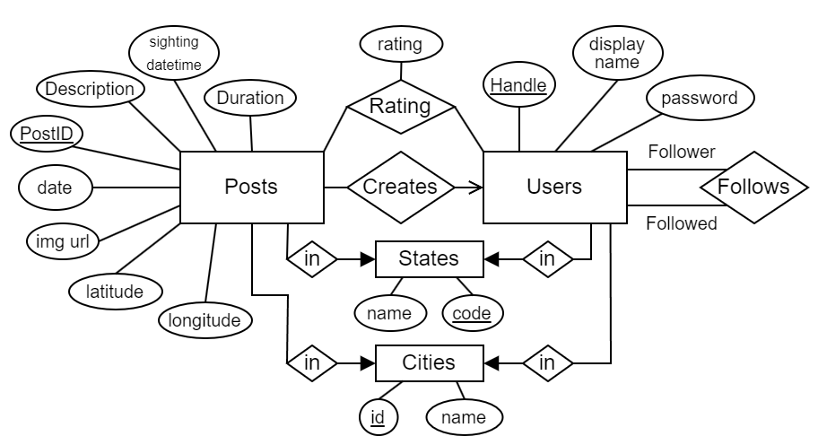

# ProbePosts
Microblogging for UFO hunters. Group project for the 2024 DIS course at UCPH.

## How To Run
Clone the repository and run the following command to install the required packages (preferably in a venv):
```
$ pip install -r requirements.txt
```
Create a new database in pgAdmin (preferably named ProbePosts) and add the following to an `.env` file in the project root:
```
DB_HOST=localhost
DB_PORT=5432
DB_NAME=ProbePosts
DB_USERNAME=postgres
DB_PASSWORD=postgres
```
If these default values don't match your setup (you might for example have a different password), modify the `.env` as needed.

To fill the database with data, run the `init_db.py` script:
```
$ python3 ./data/init_db.py
```
This will fill the data from the `/data/tables/` csv files into their corresponding tables in the postgres database specified in the `.env` file. For more on how these csv files were generated, see the 'Generating datasets' section.

The server can then be started with:
```
$ flask run
```
ProbePosts should then be available at https://localhost:5000/

## Generating Datasets
The raw UFO sightings dataset we are using for this project can be found in `/data/raw/dataset_raw.csv`. The dataset is a scrape of UFO sighting reports from https://nuforc.org and is publically available on [Kaggle](https://www.kaggle.com/datasets/joebeachcapital/ufo-sightings/data). Since image urls are not included in the dataset, we scrape them ourselves from [nuforc](https://nuforc.org) using the `/data/raw/scrape_image_urls.py` script, which generates `/data/raw/image_urls_raw.csv`.

> Scraping these images takes a *long* time. You shouldn't have to touch or run any of the files in `/data/raw/` unless you want to significantly alter the structure of the database.

We have then cleaned this dataset up using the `/data/raw/clean_dataset.py` script, which takes the `dataset_raw.csv` and `image_urls_raw.csv` files and filters out reports with non-image attachments or image links that 404. This is the script that was used to generate the `dataset.csv` and `image_urls.csv` files found in `/data/`. The `/data/init_db.py` script will later combine these files to give the posts their proper image urls when they are inserted into the database. If an image url for a post is missing in the `image_urls.csv` file (or if the file is empty), posts are just assigned a dummy image from https://picsum.photos/512.

Using the cleaned dataset, the tables used by ProbePosts can be generated by running the `/data/generate_tables.py` script:
```
$ py ./data/generate_tables.py
```
This will generate csv files for posts, users, follow relationships, etc in the `/data/tables/` folder. Note that users, ratings and follows are randomly generated.

## Using The App

### Notes

The application interface consists of two main columns. To the left, a list of page links, which we call *the sidebar*. To the right, we have the *content column*, on which the page will be displayed.

Also note that the application *does* use the internet for fetching images and the jquery library.

The E/R Diagram can be found at the [bottom of this file](#appendix).

### Signing Up and Logging In

When first launching the app, the only pages you can visit are the *Sign In* and the *Register* pages. Start by navigating to the *Register* page where you can fill out the form to create a user. Then navigate to *Sign In*, fill out your user information and login. You should now be on the main feed.

> Note: All but one of the existing users have the the password `dis`. If you do not wish to create your own account, you can use of these accounts.
> 
> As an example account you can log into, use the username `FloridaMan` which has the password `Florida`.

> Note: The rest of this guide will assume you are logged in.

### Feeds

The first two button in the sidebar (as well as the logo), take you to feeds. The *Home* feed is a global feed where every post will appear for you to scroll through. The *Following* feed will only contain posts, of users you follow and thus gives a more personal browing experience. You will learn how to follow users, in the next section.

### User Profiles

If you click on any username or on *Profile* in the sidebar, you will be taken to the page of the user.

At the top of the content column, we have a summary of the user. Here we display the users display name, handle, location and follower/following counts. You are able to follow a profile if you click on the *follow* button at the top right. (note that this button is not present if you're looking at your own profile)

Two feeds are able to be viewed under the profile information by clicking on the corresponding labels. One for everything posted by the user, and one for everything they've liked.

### Creating Posts

If you click on *Create Post* in the sidebar, you will be taken to page where you can fill out the required information for posting a sighting on the website.

### Searching For Posts

Every page has a search bar at the top. This can be used to search for posts, using tags and/or plaintext. Tags are of the form `parameter:value`, and are used to narrow down your search by post metadata instead of only description text. Available tags are:
* `before`, posted before a specified date
* `after`, posted after a specified date
* `city`, spotted in a specified city
* `state`, spotted in a specified state
* `from`, post is from a specified user

An example search would be:
```
from:FloridaMan after:2023-03-04 city:Tampa strange
```
This query returns all posts that are from the user `FloridaMan`, posted after `March 4th, 2023`, spotted in the city `Tampa` and has the string `strange` in its description.


## Appendix

