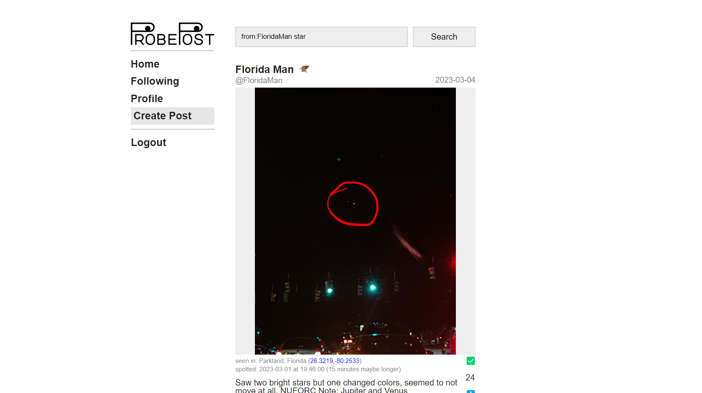

# ProbePosts
Microblogging for UFO hunters.

TODO: longer description



# How to run
Clone the repository and run the following command to install the required packages (preferably in a venv):
```
$ pip install -r requirements.txt
```
Create a new database in pgAdmin (preferably named ProbePosts) and add the following to an `.env` file in the project root:
```
DB_HOST=localhost
DB_PORT=5432
DB_NAME=ProbePosts
DB_USERNAME=postgres
DB_PASSWORD=postgres
```
If these default values don't match your setup (you might for example have a different password), modify the `.env` as needed.

To fill the database with data, navigate to the /data/ folder and run the `init_db.py` script:
```
$ py init_db.py
```
This will fill the data from the `posts.csv`, `users.csv`, `states.csv` and `cities.csv` into the corresponding tables in the postgres database specified in the `.env` file. For more on this data was generated, see the 'Generating datasets' section.

The server can then be started with:
```
$ flask run
```
ProbePosts should then be available at https://localhost:5000/

## Generating datasets
The raw UFO sightings dataset we are using for this project can be found in the /data/ folder. The dataset is a scrape of UFO sighting reports from  https://nuforc.org and is publically available on [Kaggle](https://www.kaggle.com/datasets/joebeachcapital/ufo-sightings/data).

To generate all the tables used by ProbePosts from this dataset, you can navigate to the /data/ folder and run
```
$ py generate_dataset.py
```
This generate csv files for posts, users, and follow relationships.

Note that the image urls for posts are not included in the generated posts.csv table. These instead have to be scraped by running
```
$ py scrape_image_urls.py
```
This is **not** recommended, however, since the UFO sighting reports website the images are being scraped from is *very* slow. The `init_db.py` script will then combine these datasets to give the posts their proper image urls. If an image url for a post is missing in the `image_urls.csv` file (or if the file is empty), posts are just assigned a dummy image from https://picsum.photos/512.